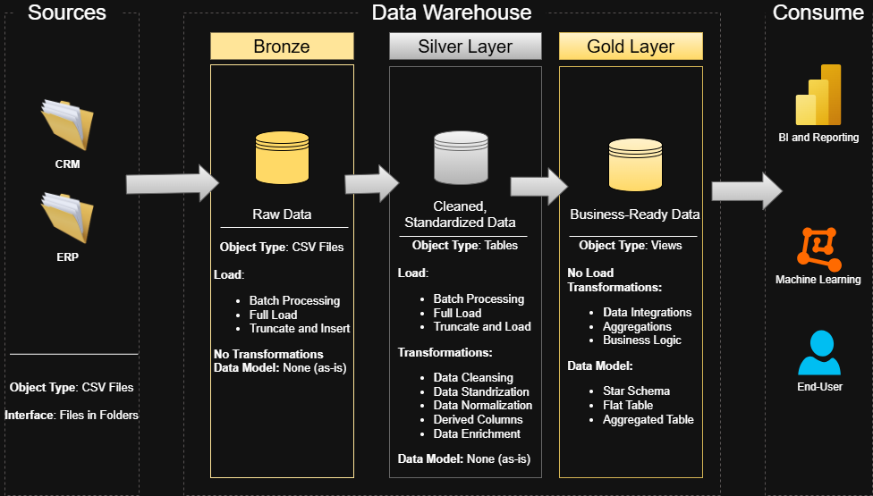

# SQL Data Warehouse Project ([Medallion Architecture](https://www.databricks.com/blog/what-is-medallion-architecture))

## Overview
This project focuses on building a **modern SQL-based Data Warehouse** using **Medallion Architecture (Bronze → Silver → Gold)** on **Microsoft SQL Server**.

The pipeline ingests raw data from **CRM and ERP systems (CSV files)** and processes it using **batch processing with a full load strategy**.

The goal is to design a scalable, modular, and production-ready data warehouse that demonstrates real-world data engineering practices.

---

## Architecture

### Medallion Architecture Layers


#### Bronze Layer (Raw Data)
- Stores raw, unprocessed data from source systems
- Data is ingested as-is from CSV files
- Acts as the single source of truth

#### Silver Layer (Cleaned, Standardized Data)
- Data is cleaned, standardized, and validated
- Handles missing values, duplicates, and data type corrections
- Prepares structured data for business logic

#### Gold Layer (Business-Ready Data)
- Contains aggregated and business-ready data
- Optimized for reporting and analytics
- Used for dashboards and decision-making

---

## Tech Stack

- **Database**: Microsoft SQL Server  
- **Data Sources**: CRM & ERP (CSV files)  
- **Processing Type**: Batch Processing  
- **Loading Strategy**: Full Load  (Truncate and Load)
- **Architecture**: Medallion Architecture  
- **Design Tool**: Draw.io  

---
## Naming Convention
### Tables
All names must strat with the source system name, and table names must match their original names without renaming.
`<sourcesystem>_<entity>`
  - `<sourcesystem>`: Source system name (e.g., `erp`, `crm`)
  - `<entity>`: Exact table name from the source system
    
  - **Example:**
    `crm_customer_info`
    *(Customer information from CRM system)*
### Stored Procedure
`load_<layer>`
  - `<layer>` represents the layer being loaded, such as `bronze`, `silver` or `gold`
  - **Example:**
    `load_bronze`
    *(Stored Procedure for loading data into the Bronze Layer)*
 
## Project Structure
```
SQL-Data-Warehouse-Project/
├── LICENSE
├── README.md
├── datasets/
│   ├── source_crm/
│   │   ├── cust_info.csv
│   │   ├── prd_info.csv
│   │   └── sales_details.csv
│   └── source_erp/
│       ├── CUST_AZ12.csv
│       ├── LOC_A101.csv
│       └── PX_CAT_G1V2.csv
├── docs/
│   ├── data_architecture.png
│   ├── data_catalog.md
│   ├── data_flow_diagram.png
│   ├── data_model.png
│   └── integration_model.png
├── scripts/
│   ├── bronze/
│   │   ├── ddl_bronze.sql
│   │   └── procedure_load_bronze.sql
│   ├── gold/
│   │   └── ddl_gold.sql
│   ├── init_database.sql
│   └── silver/
│       ├── ddl_silver.sql
│       └── procedure_load_silver.sql
└── tests/
    ├── quality_checks_gold.sql
    └── quality_checks_silver.sql
```

## License
This Project is licensed under the [MIT License](LICENSE). Feel Free to use and modify. :-)

---


